# 🗄️ SQL Data Engineering: From Foundation to Advanced


> **Welcome!** This repository hosts a comprehensive SQL learning path designed for Data Engineering. It systematically covers everything from fundamental syntax to complex nested queries and database design principles.

---

## 🗺️ Repository Structure & Learning Roadmap

The content is organized into 5 progressive modules:

### 1️⃣ 01_SQL_FOUNDATION
*Mastering the essentials of data retrieval and filtering.*
- `📜 SELECT-BASIC.sql`: Core syntax for retrieving data.
- `🔍 where-filtering.sql`: Precision data filtering techniques.
- `🌪️ order-by-sorting.sql`: Sorting logic and data organization.
- `🧩 like-pattern-matching.sql`: Text search using RegEx patterns.
- `🚫 null-handling.sql`: Strategies for managing missing values.

### 2️⃣ 2-TABLE-AND-KEYS
*Deep dive into Schema Design, Constraints, and Relationships.*
- `🔑 4-surrogate-key.sql`: Implementation of Surrogate Keys.
- `🔗 5-foreign-key-relationship.sql`: Enforcing Referential Integrity.
- `🌲 6-hierarchical-table.sql`: Managing parent-child data structures.
- `🏗️ Table-And-Constraints.sql`: Data integrity rules.
- `🎓 Database-Design`: Real-world Student Management System example.

### 3️⃣ 3-Data-Combination-JOIN-UNION
*The art of merging datasets from multiple sources.*
- `🤝 01 SQL-Joins-Real-World-Queries.sql`: Practical JOIN scenarios (Inner, Left, Right).
- `📚 Advanced-Joins`: Complex joining logic and Set Operations (UNION, INTERSECT).

### 4️⃣ 4-Aggregation-and-Grouping
*Transforming raw rows into actionable insights.*
- `🧮 Aggregate-Min-Max...`: Statistical functions for data analysis.
- `📊 COUNT-and-NULL-Handling.sql`: Accurate reporting with NULL datasets.

### 5️⃣ 5-SQL-NESTED-QUERY
*Solving complex problems using sub-queries.*
- `📦 01-single-row-subqueries.sql`: Scalar subqueries.
- `📚 02-multi-row-subqueries.sql`: Handling list returns.
- `🖼️ 03-derived-tables.sql`: Virtual tables in the FROM clause.
- `⚖️ 04-quantified-comparison.sql`: Advanced logic with ALL, ANY, SOME.

---

## 🛠️ Tech Stack
* **Language:** SQL (Structured Query Language)
* **Editor:** VS Code
* **Extensions:** SQLTools / Azure Data Studio

## 🛠️ Tech Stack & Tools

<div align="center">


</div>

---

## 🚀 Getting Started

Follow these steps to set up your local environment.

### 1️⃣ Clone the repository
Open your terminal and run the following command to download the source code:

```bash
git clone [https://github.com/your-username/SQL-Data-Engineering.git](https://github.com/your-username/SQL-Data-Engineering.git)
cd SQL-Data-Engineering
```
### 2️⃣ Navigate & Execute

Since the repository is structured by topic, follow this simple workflow:

* **📂 Step 1:** Open the folder corresponding to your learning module (e.g., `5-SQL-NESTED-QUERY`).
* **▶️ Step 2:** Open any `.sql` file in **VS Code**.
* **🚀 Step 3:** Execute the query using your preferred SQL Client or Extension.

> [!TIP]
> **Pro Tip:** If using the *SQLTools* extension, highlight the code block and press `Ctrl+E` to see results instantly.

---

## 🤝 Contributing Ecosystem

We believe in the power of open source. If you have a **better optimization** or a **new challenge**, join us!

```mermaid
graph LR
    A[🔱 Fork] --> B[💻 Branch]
    B --> C[✨ Commit]
    C --> D[🚀 Push]
    D --> E[🔀 Pull Request]
    style A fill:#252526,stroke:#fff,stroke-width:2px,color:#fff
    style E fill:#007acc,stroke:#fff,stroke-width:2px,color:#fff
```


